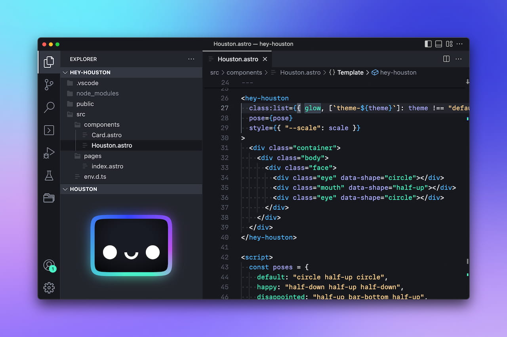
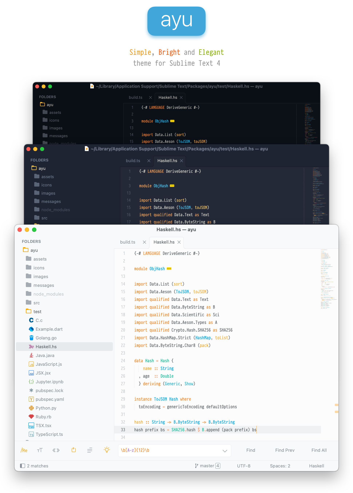
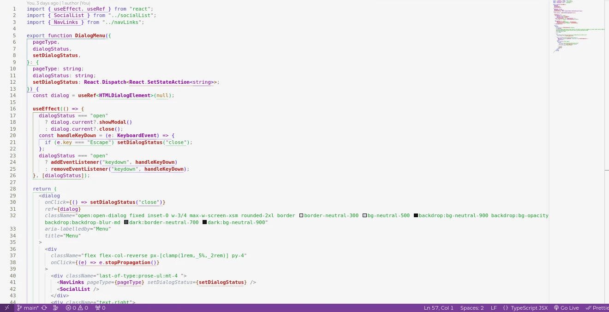

In this post, I'll go into some of my favorite Visual Studio Code themes that have caught my eye and influenced my coding experience.

## Houston Theme

This theme is from [Astro](https://github.com/withastro/). It features a soft and cool blues, minty greens, and soft purples.

One day I was just browsing for some VS Code theme and I came across this one, and looking from its preview it made me want to install it immediately and I really liked it, but it doesn't have a light mode. But Houston theme is still in progress accoriding to its [github repository](https://github.com/withastro/houston-vscode), so it might have a light mode in the future.

Also, it came with an _image-emoji_ face that they call 'Astro's mascot Houston' which looks cute.

[Install Houston Theme](https://marketplace.visualstudio.com/items?itemName=astro-build.houston)

## Ayu Theme

> `ayu` is a simple theme with bright colors and comes in three versions — dark, mirage and light for all day long comfortable work.

I discovered this just after I installed the Houston Theme, and this one I really like. It comes with three different versions.

The dark version, the mirage version, and a light version, you can also chose to have a borders("ui_separator"). What I like the most is the dark and the mirage version, but not the light one; maybe because of its contrasts.

This theme is just pretty clean and not very distracting to the eye, and the contrast of texts in the dark and mirage version is really great.

[Install Ayu Theme](https://marketplace.visualstudio.com/items?itemName=teabyii.ayu)

## Abyss

Now this one is built-in inside visual studio code. It is a dark blue theme, and most of its colors are also dark shade.

This is also the theme I was using before I used Houston and Ayu theme.

## Quite Light

Quite light is a light mode theme with a purple accent, and this is the best light theme that I have seen so far. I just found out about it while writing this post.

Just like the Abyss theme, this one is also built-in inside visual studio code, so it doesn't have to be installed.
